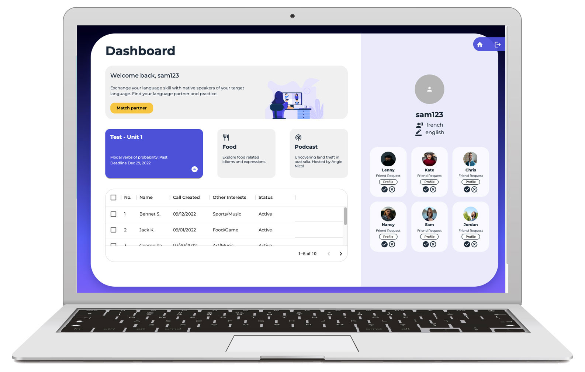

# Languly(Video_Web_App)

**_Languly is an online platform that language learners can exchange their language skills and find lanuage partner._**

This was my capstone project at Brainstation. With the full two weeks of capstone work period, sprint-1 was completed. Ideal screen size to run this code is at 1500px.

[Demo link](https://www.youtube.com/watch?v=wkKaz5o2RY8)

[Frontend](https://github.com/jclairelee/VideoWebApp-Languly) | [Backend](https://github.com/jclairelee/Languly-api)



## Tech Stack

### Frontend:

- Material UI
- Redux
- Socket Client
- WebRTC
- Framer Motion
- React
- Sass

### Backend:

- Node.js / Express
- MongoDB
- Socket.io

# Installation

### backend Setup

1. Install server dependencies:

   Run `npm install` from inside the directory:

   ```bash
   $ npm install
   ```

2. Set environment variables:

   Create a `.env` file as:

   ```shell
    API_PORT=5002
    MONGO_URI=<YOUR DB URI>
    TOKEN_KEY=<YOUR TOKEN KEY>
   ```

3. Start the server:
   ```bash
   $ npm start
   ```

### frontend Setup

4. Install client dependencies:

   Run `npm install` from inside the directory.

   ```bash
      $ npm install
   ```

5. Start the React app:
   ```bash
   $ npm start
   ```
